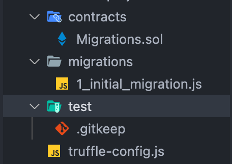
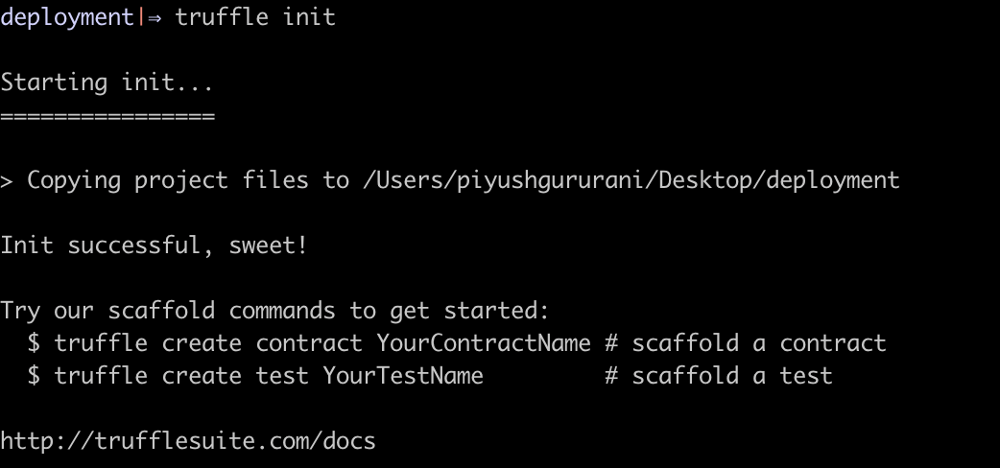
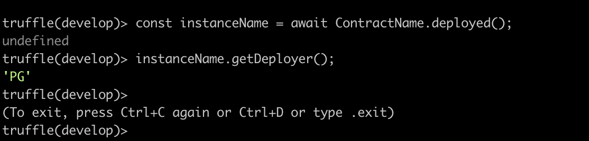

# Part 1 :

## Prerequisites

1. Visual Code Editor [(VS code)](https://code.visualstudio.com/) (recommanded)
2. Node.js and Node Package Manager [(NPM)](https://nodejs.org/en/)
3. [Truffle](https://trufflesuite.com/)
4. Solidity Knowledge

## Get Started

Create an empty directory at your desired location

>  mkdir lpu_truffle
>  cd lpu_truffle

## Installation

**NOTE**: Make sure that truffle is installed otherwise install it using the command.

> npm install -g  truffle

inside the deploy-your-first-smart-contract-with-truffle directory/ run:

>  truffle init

You will see the files and folders created by truffle something like this: you will find the same files and folders inside the starter-project folder of this repo.





**contracts:** Inside the contracts folder we create our smart contracts.

**migrations:** migrations are javascript files that helps truffle to deploy smart contract.

**test:** Inside test folder we create test files where we test our smart contract.

we are just going to looking inside each by create our own from scratch.

## Create Smart Contract

Go to the contracts directory

> cd constracts/

run

> truffle create contract ContractName //set whatever the contract name you like.

you will see the newly created file with the name you write above inside contracts folder and when you will open it, it will look something like this.

```
// SPDX-License-Identifier: MIT
pragma  solidity  >=0.4.22  <0.9.0;
contract  ContractName {
constructor() public {
}
}
```

Truffle created the smart contract with the name you write above along with the public constructor and the pragma like at the top.

Now change this file code with the below code.

```
// SPDX-License-Identifier: MIT
pragma solidity >=0.4.22 <0.9.0;
contract LearnContract {
    string deployer = "LPU";
    function getDeployer() external view returns (string memory) {
        return deployer;
    }
}
```

The contract contains state string variable and a method that return the deployer name setted above it.

make sure to change the name of contract if you wrote different and also update the deployer name.

## Compile the source code

run:

```
truffle compile
```

this command will create the build artifacts of the smart contract and put inside ./build/contracts directory.

Now we will deploy this smart contract.

## Create a Migration File

Migration files are the javascript files that help truffle to deploy the smart contracts. As we saw above when we initialize the truffle it created a **Migrations.sol** smart contract and its migration file is named **1_initial_migration.js**. This is the special contract created by truffle that keeps track of our code on-chain. It is like the history of our code changes save on-chain so that we could not ever deploy the same code again.

For deploying multiple smart contract, we need to create a separate migration file for each smart contract and give them order like at the start 1, 2, 3, etc. Migrations files will always execute in order.

1. Create a new migration file for our smart contract inside the migrations folder. You can give whatever name you like but the sequence should be followed.

> cd migrations/
> touch 2_learn_contract.js

paste the following code inside 2_learn_contract.js file:

```
const LearnContract = artifacts.require("LearnContract");

module.exports = function (deployer) {
    deployer.deploy(LearnContract);
}
```

2. Initialize the artifacts of the smart contract so that we can interact with it (see on the first line).

**Note: The build artifacts are comprised of the "bytecode" versions of the smart contracts, ABIs, and some internal data Truffle is using to correctly deploy the code.**

3. Export a function that will deploy the smart contract.

Give deployer as paramter and using the method of that parameter deploy the smart contract. This object act as an interface between developer and truffle.

## Deploy to Local Blockchain

We can use the built-in local blockchain that truffle contains called **Ganache**.

**Ganache is a personal/local blockchain for rapid Ethereum and Corda distributed application development. You can use Ganache across the entire development cycle; enabling you to develop, deploy, and test your dApps in a safe and deterministic environment.**

1. Start the local blockchain, run the command.

> truffle develop

it will also start the developer console, where you can interact with the smart contact.

2. deploy the smart contract, run the command.

> migrate

this will check the compilation and deploy the smart contracts.

You just deployed the smart contract on the local blockchain.

3. Now to interact with the deployed smart contract with the developer console:
   
   i. Create the deployed contract instance.
   
   ```
   const instanceName = await ContractName.deployed();
   ```

make sure to replace the ContractName with you smart contract name, and you can give any instance name.

Now we have instance of the smart contract, we can interact with it and get anything that is publically available. So let's call our deployer method.

ii. Call our getDeployer() method so we can check either everything works fine or not.

```
   instanceName.getDeployer();
```

you will see something like this.

that's it you have now deployed on local blockchain and interact with it also. Now let's learn to deploy on public testnet.



**Note: to exit from truffle developer console type .exit**

# Part 2

Once above is in working condition , update the contract to have following behaviour :

Create a Solidity smart contract for a decentralized auction system. The contract should allow the owner to create an auction with a starting price and a duration. Participants can bid during the auction period, and the highest bidder wins when the auction ends. The contract should include the following functionalities:

- **Auction Creation (`startAuction`):**
  
  - Only the owner can create an auction with an item name, a starting price, and a duration.
  - Resets auction state variables for new auctions.

- **Bidding Mechanism (`bid`):**
  
  - Allows participants to place bids if the auction is active and within the specified duration.
  - Enforces that each bid must be higher than the current highest bid and the starting price.
  - Refunds the previous highest bidder by adding their bid to the `pendingReturns` mapping.

- **Withdraw Mechanism (`withdraw`):**
  
  - Allows non-winning bidders to withdraw their funds securely after the auction ends.
  - Prevents re-entrancy attacks by resetting the `pendingReturns` balance before transferring Ether.

- **Finalizing the Auction (`finalizeAuction`):**
  
  - Allows only the owner to finalize the auction after the duration ends.
  - Transfers the highest bid amount to the owner and resets the auction state.

```
// SPDX-License-Identifier: MIT
pragma solidity ^0.8.0;

contract DecentralizedAuction {
    // State Variables
    address public owner; // Owner of the contract
    uint256 public auctionEndTime; // Auction end timestamp
    string public itemName; // Name of the item being auctioned
    uint256 public startingPrice; // Starting price of the auction
    bool public isAuctionActive; // Indicates if the auction is active

    address public highestBidder; // Address of the highest bidder
    uint256 public highestBid; // Amount of the highest bid

    mapping(address => uint256) public pendingReturns; // Tracks refunds for non-winning bidders

    // Constructor
    constructor() {
        // Set the owner of the contract
    }

    // Modifier: Restrict function access to the contract owner
    modifier onlyOwner() {
        _;
    }

    // Function to start an auction
    function startAuction(string memory _itemName, uint256 _startingPrice, uint256 _duration) public onlyOwner {
        // Logic to initialize the auction
    }

    // Function to place a bid
    function bid() public payable {
        // Logic to place a bid
    }

    // Function to withdraw unsuccessful bid amounts
    function withdraw() public {
        // Logic for unsuccessful bidders to withdraw funds
    }

    // Function to finalize the auction
    function finalizeAuction() public onlyOwner {
        // Logic to finalize the auction and transfer funds
    }

    // View function to check if the auction has ended
    function hasAuctionEnded() public view returns (bool) {
        // Return whether the auction duration has elapsed
    }
}
```
